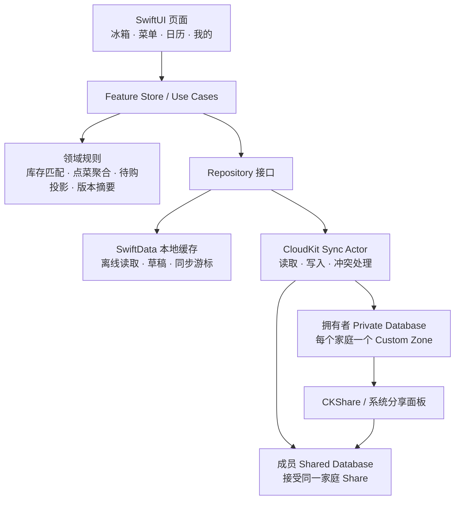

# 小家厨房 iOS 开发蓝图 v0.1

## 0. 本轮结论

首版做成 **iPhone 优先、iOS 17+、中文优先** 的原生 SwiftUI App。它以家庭协作为中心，先完整打通一条高频闭环：

> 成员点菜 → 确认当天菜单 → 核对冰箱 → 生成待购清单 → 做完后评分。

首版不做账号密码体系、不做外卖支付、不做菜谱社区，也不接入 OCR/AI 识图。家庭协作使用 iCloud/CloudKit 的原生分享能力；这要求每位成员已登录 iCloud。

## 1. 发布范围与成功标准

### 必须交付（MVP）

- 创建家庭、邀请家庭成员、接受邀请并进入同一个共享家庭。
- 菜谱的新建、编辑、浏览、搜索、分类、评分、点评和修改记录。
- “想吃”点菜，以及将一到多道菜安排到指定日期。
- 月历与当天菜单，支持新增、移除、排序和确认状态。
- 手动维护冰箱库存、按菜谱核对库存、自动生成待购食材。
- 没有网络时可以查看最近同步内容并继续编辑；恢复网络后自动同步。

### 明确不做（MVP 以后）

- 食材扫描、票据/OCR、自动识图、营养计算与智能推荐。
- 复杂单位换算、菜量缩放和多冰箱/多储物位置。
- 外卖下单、支付、公开菜谱社区、聊天。
- 家庭所有者转移、细粒度服务端权限审计、跨平台 Android/Web。

### 可验收的一次真实使用

1. 成员 A 建立“林家厨房”，创建菜谱“宫保鸡丁”并邀请成员 B。
2. B 接受邀请后，看到同一份菜谱并给它点到周五晚餐。
3. A 确认周五菜单；系统根据现有冰箱库存显示“花生缺少”。
4. 待购清单只出现一项花生；B 勾选已购买后，菜谱变为“食材齐全”。
5. A 修改调味料并保存；B 能在修改记录中看到修改人、时间与前后版本。

## 2. 架构决策

### 客户端分层



- **SwiftUI**：每个底部标签拥有独立 `NavigationStack`，页面只呈现状态并触发用例，不直接读写 CloudKit。
- **Feature Store / Use Case**：负责用户意图，例如 `voteForRecipe`、`confirmMealPlan`、`updatePantryItem`。
- **领域规则**：库存匹配、待购清单、菜单状态和版本摘要必须是可单元测试的纯 Swift 类型。
- **Repository**：屏蔽本地缓存和 CloudKit 的细节，让界面可先用内存样本开发。
- **CloudKit Sync Actor**：串行执行远端读写、记录同步游标、处理重试和冲突；禁止从 View 直接调用 `CKContainer`。
- **SwiftData**：仅作为设备端缓存、草稿和查询投影；CloudKit 是家庭共享数据的最终来源。这样不会把 SwiftData 的自动同步能力与跨 iCloud 用户分享耦合在一起。

### 为什么选择原生 CloudKit 分享

CloudKit 的共享记录以所有者的私有数据库为源，受邀者在自己的共享数据库中看到共享内容；`CKShare` 可共享一个自定义记录区或一棵记录层级。这正好映射到“一个家庭、一组协作数据”。[Apple：Shared Records](https://developer.apple.com/documentation/CloudKit/shared-records)

实现上，**一个家庭对应拥有者私有数据库中的一个 Custom Zone，并对这个区建立一个 zone-wide `CKShare`**。成员接受邀请后，App 从其 Shared Database 读取同一个家庭区。默认区不能用于分享，而一个记录区只能属于一份分享，因此“每家庭一个自定义区”是清晰且可维护的边界。[Apple：CKRecordZone share](https://developer.apple.com/documentation/cloudkit/ckrecordzone/share)

必须在项目中配置 iCloud/CloudKit capability，并在 `Info.plist` 设置 `CKSharingSupported = true`，以便用户点击邀请链接后系统能唤起 App。[Apple：CKSharingSupported](https://developer.apple.com/documentation/BundleResources/Information-Property-List/CKSharingSupported)

### 权限边界

- CloudKit Share 统一提供家庭成员读写权限，适合受信任的家庭协作场景。
- “管理员”是产品角色：控制邀请、移除成员和家庭资料入口；首版在客户端执行这个规则。
- 这不是针对恶意成员的强制服务器 ACL。若未来需要不可绕过的逐字段权限、所有者转移或审计，需要增加自有服务端。
- 所有者是 CloudKit 数据的实际拥有者；成员离开只移除其分享资格，不会影响其他成员数据。所有者转移排到第二阶段。

## 3. 项目结构

```text
LittleKitchen/
├── App/
│   ├── LittleKitchenApp.swift
│   ├── AppCoordinator.swift
│   └── RootTabView.swift
├── Core/
│   ├── DesignSystem/          # 色彩、字体、卡片、状态标签、缩略图
│   ├── Domain/                # Model、值对象、纯业务规则
│   ├── Persistence/           # SwiftData 缓存、迁移、样本数据
│   ├── CloudKit/              # Record 映射、Share、Sync Actor、订阅
│   └── Support/               # 日期、日志、错误、可访问性
├── Features/
│   ├── Onboarding/
│   ├── Family/
│   ├── Recipes/
│   ├── MealPlan/
│   ├── Pantry/
│   └── Profile/
├── Resources/
│   ├── Assets.xcassets
│   └── Localizable.xcstrings
└── LittleKitchenTests/
```

每个 Feature 内再按 `View`、`Store`、`UseCase`、`Components` 组织。通用卡片、标签和空状态只放进 `Core/DesignSystem`，避免四个 Tab 产生不同的视觉语言。

## 4. 领域模型与 CloudKit 记录

所有共享记录均带有 `householdID`、`createdAt`、`updatedAt`、`createdByUserID` 和逻辑删除字段；记录 ID 不以用户可编辑的名称生成。

| 领域模型 / Record | 关键字段 | 用途 |
| --- | --- | --- |
| `Household` | `name`, `ownerUserID`, `coverStyle` | 家庭根信息与显示名称。 |
| `MemberProfile` | `userID`, `displayName`, `avatarStyle`, `role` | 显示成员与产品角色。 |
| `Recipe` | `title`, `category`, `coverStyle`, `servings`, `duration`, `version`, `searchText` | 一道菜的当前版本。 |
| `RecipeIngredient` | `recipeID`, `kind`, `canonicalIngredientID`, `displayName`, `quantity`, `unit`, `sortKey` | 主菜、辅材与调味料；`kind` 决定分组。 |
| `RecipeStep` | `recipeID`, `text`, `sortKey` | 操作步骤。 |
| `RecipeRevision` | `recipeID`, `version`, `summary`, `snapshotAsset`, `editedBy`, `editedAt` | 不可变修改记录；完整快照用 CloudKit Asset 存储。 |
| `RecipeReview` | `recipeID`, `authorID`, `rating`, `comment`, `updatedAt` | 每人每菜一份，可覆盖更新。 |
| `MealPlanDay` | `dateKey`, `status`, `confirmedBy`, `confirmedAt` | 日期使用本地日历的 `yyyy-MM-dd`，避免展示日跨时区。 |
| `MealPlanItem` | `mealPlanDayID`, `recipeID`, `sortKey`, `addedBy`, `source` | 一天的其中一道菜；`source` 表示点菜/手动安排。 |
| `RecipeVote` | `recipeID`, `dateKey?`, `authorID`, `createdAt` | “我想吃”或指定日期点菜。 |
| `PantryItem` | `canonicalIngredientID`, `displayName`, `category`, `quantity?`, `unit?`, `expiryDate?` | 家庭库存。数量/单位允许缺省。 |
| `IngredientAlias` | `alias`, `canonicalIngredientID` | 家庭自定义的食材同义词，例如“洋葱/圆葱”。 |
| `ShoppingItem` | `canonicalIngredientID`, `displayName`, `isManual`, `isChecked` | 保存用户手动添加和勾选状态。系统所需项在运行时投影，不复制存储。 |

### 数据关系

- `RecipeIngredient`、`RecipeStep`、`RecipeRevision` 和 `RecipeReview` 都是 `Recipe` 的子记录。
- `MealPlanItem` 是 `MealPlanDay` 的子记录；`RecipeVote` 独立记录以便多人并发点同一道菜。
- 所有记录保存在家庭的同一个 Custom Zone。删除家庭时由所有者停止分享并清理记录区；MVP 不提供 App 内“删除整个家庭”入口。
- 搜索通过 `Recipe.searchText` 保存标题、分类和食材名的归一化拼接文本；首版在本地缓存中完成搜索，以保证离线可用。

## 5. 关键业务规则

### 菜谱版本与并发编辑

1. 用户打开编辑页时记住当前 `version` 和 CloudKit `changeTag`。
2. 保存时先生成一个不可变 `RecipeRevision`，再保存新的当前菜谱与子记录。
3. 若服务器返回版本冲突，保留本地草稿，拉取最新版本，并让用户选择“基于最新版本继续编辑”或“保存为新菜谱”。
4. 不采用静默的最后写入覆盖；家庭协作中丢失食材或步骤比多一次确认更糟。

### 库存匹配与待购清单

```text
已确认日期的菜谱食材
        ↓  按 canonicalIngredientID 聚合
所需总量 ─── 对照 PantryItem 的可用量 ───→ 充足 / 不足 / 缺少 / 待确认
        ↓
缺少或不足项 - 已勾选/手动覆盖状态 → 待购清单投影
```

- 仅 `confirmed` 的 `MealPlanDay` 参与待购计算；想吃和待确认不会触发采购。
- 同一食材且单位相同可以聚合数量；数量缺失、单位不同或无法换算时标记“待确认”。
- 首版只支持 `g`、`kg`、`ml`、`L`、`个`、`份`、`包` 的直接或同类别换算；其余不猜测。
- 勾选购买不会自动增加库存。购买者需要在冰箱页确认入库，避免“买了但没到家”造成误判。
- `ShoppingItem` 只保存人工加入与勾选；系统缺少项每次在本地重新计算，因此菜谱、日期或库存变动不会留下过期待购项。

### 日历与点菜

- 一天可有多个 `MealPlanItem`，以 `sortKey` 决定烹饪/展示顺序。
- `draft` 表示成员正在讨论，`confirmed` 表示参与库存核对，`completed` 表示已做完，`cancelled` 不展示在默认日历。
- 同一成员对同一菜谱在同一天仅保留一条点菜记录；再次点击变为取消点菜。
- 删除日历安排只删除 `MealPlanItem`，不会删除菜谱、点评、历史或库存。

## 6. 页面与状态设计

| 页面 | 首屏职责 | 关键状态 |
| --- | --- | --- |
| 欢迎 / 加入家庭 | 创建家庭、接受系统分享邀请、补充昵称 | 未登录 iCloud、邀请失效、加入成功。 |
| 菜单 | 展示今天菜单、家庭点菜与可做菜谱 | 空家庭、无菜谱、加载、离线、库存待确认。 |
| 菜谱详情 | 阅读、点菜、安排、评分、查看历史 | 作者编辑中、库存不足、无点评、冲突。 |
| 新建/编辑菜谱 | 四段式输入和草稿保存 | 必填校验、未保存草稿、版本冲突。 |
| 日历 / 当天菜单 | 安排、确认和排序一天的菜 | 空日期、待确认、已确认、已完成。 |
| 冰箱 / 待购 | 维护库存、解释缺少原因、入库/勾选 | 空库存、临期、单位待确认、离线变更。 |
| 我的 / 家庭 | 成员、邀请、个人偏好、退出家庭 | 所有者、普通成员、无网络。 |

所有页面均提供：加载骨架、无数据引导、错误可重试、离线状态、动态字号和 VoiceOver 标签。视觉实现沿用已确认的奶油白、鼠尾草绿、胡萝卜橙、番茄红与统一圆角卡片规范。

## 7. 开发迭代与分支节奏

下表按“一位 iOS 开发者、CloudKit entitlement 已可用”的连续工作量估算；实际周期受真机 iCloud 分享测试和设计细节调整影响。

| 迭代 | 建议工作量 | 交付内容 | 建议分支 |
| --- | ---: | --- | --- |
| 0. 工程基座 | 1–2 天 | Xcode 项目、Bundle ID、Capabilities、目录、设计系统、样本数据、CI 基础检查 | `chore/bootstrap-ios` |
| 1. 本地点菜闭环 | 3–4 天 | 菜单、菜谱详情/编辑、点菜、评分；全部基于样本与本地缓存 | `feature/recipe-voting` |
| 2. 日历与库存 | 3–4 天 | 月历、当天菜单、冰箱录入、库存匹配与待购投影 | `feature/meal-plan-pantry` |
| 3. 家庭共享 | 4–6 天 | Custom Zone、CKShare 邀请/接受、私有/共享区同步与冲突处理 | `feature/cloudkit-households` |
| 4. 历史与打磨 | 3–4 天 | 菜谱版本、搜索筛选、离线队列、空状态、可访问性 | `feature/revisions-and-polish` |
| 5. 验收发布 | 2–3 天 | 双账号真机验证、TestFlight、隐私说明、崩溃与同步问题修复 | `release/mvp-testflight` |

每一轮都从最新 `main` 创建聚焦分支，完成一个功能块即提交、推送并发起 PR；合并后回到最新 `main` 再开始下一轮，不在未合并分支上叠加大功能。

## 8. 测试策略

### 自动化测试

- **Domain 单元测试**：单位换算、库存状态、待购投影、点菜去重、状态迁移、排序、版本摘要。
- **Repository 测试**：CloudKit Record 与领域模型双向映射、软删除、日期键、错误转换。
- **Feature Store 测试**：新建菜谱、保存失败保留草稿、确认菜单触发重新匹配、成员评价覆盖。
- **UI 测试**：首次创建家庭、菜谱四段式表单、日历安排、冰箱入库、离线提示。
- **快照测试（可选）**：四个主 Tab 的浅色模式、最大动态字号与空状态，稳定视觉语言。

### 手工真机验证

- 使用两个不同 iCloud 账号、两台真机，验证邀请、接受、写入、删除和离线恢复。
- 在飞行模式下创建草稿/录入库存，再恢复网络，确认不丢失修改也不重复写入。
- 分别验证所有者、普通成员和被移除成员。
- 检查中文长菜名、多个食材、没有数量、过期日、动态字号、VoiceOver、深色模式的降级显示。

## 9. 工程与发布前置条件

在开始迭代 0 前，需要准备：

1. 一个 Apple Developer Team、最终 Bundle Identifier 和 CloudKit Container Identifier。
2. 两个可用于测试的不同 iCloud 账号，以及至少两台可以登录这些账号的设备/模拟器组合。
3. Git 仓库初始化、远端地址和 CI 凭据；当前目录尚不是 Git 仓库，因此这是开始编码前的首个工程动作。
4. App 名称暂以“小家厨房”为工作名称；确定后再创建 App Icon、启动页与 App Store 文案。

## 10. 风险与应对

| 风险 | 应对 |
| --- | --- |
| iCloud 未登录或家庭成员无法接受邀请 | 欢迎页先检测账号状态；提供明确引导和重试，不把用户困在空白页。 |
| CloudKit 分享接受与同步时序复杂 | 迭代 3 单独验收，不能与大量 UI 改动混在同一 PR。 |
| 菜谱多人同时编辑 | 保留草稿与版本，不静默覆盖。 |
| 食材名称和单位不统一 | 引入 canonical ID 与家庭别名；无法确定时诚实显示“待确认”。 |
| 待购清单遗留过期条目 | 系统项动态投影，只有人工项与勾选状态持久化。 |
| 真实家庭觉得录入冰箱麻烦 | MVP 保持手动录入最短路径；扫码/OCR 是否加入由 TestFlight 反馈决定。 |

## 11. 开始编码后的第一项交付

第一个 PR 只建立可运行的 iOS 工程和可浏览的本地样本体验：四个 Tab、完整设计令牌、菜单首页、菜谱详情和新建菜谱表单。此 PR 不接 CloudKit，不做家庭邀请，确保视觉和领域模型能先稳定下来。

第二个 PR 再将“点菜 → 日历 → 冰箱匹配 → 待购清单”接成可测的本地闭环。只有这个闭环在本地使用顺畅后，才进入 CloudKit 家庭共享。
